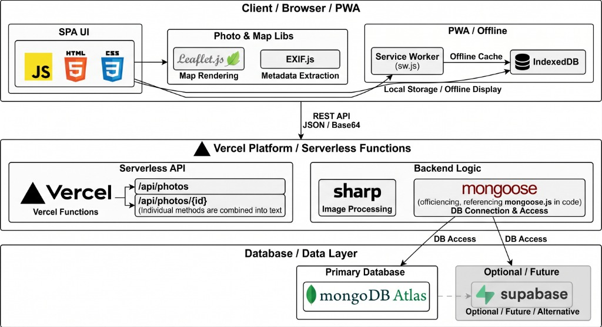

# Date Memory

ふたりのデートの思い出や日常の写真を記録・振り返るためのプライベートWebアルバムアプリです。

## システム構成図 (Architecture)



### アーキテクチャの概要

本アプリケーションは、**「フロントエンドSPA / PWA」**、**「Vercel サーバーレスバックエンド」**、**「クラウドデータベース」** の3層構造で設計されています。

1. **Client / Browser / PWA (フロントエンド層)**
   - **SPA UI (HTML5 / CSS3 / JavaScript)**: バンドラー不要の素早い動作とレスポンシブなUI操作を提供。
   - **Photo & Map Libs**:
     - `Leaflet.js`: 国土地理院タイルを用いたスポット・地図のインタラクティブ描画。
     - `EXIF.js`: アップロード写真からの撮影日時・GPS位置情報等のメタデータ抽出。
   - **PWA / Offline**:
     - `Service Worker (sw.js)`: アプリシェルと静的アセットをオフラインキャッシュ。
     - `IndexedDB`: 端末ローカルへの写真データ・キャッシュ保持により、オフライン閲覧および高速表示を実現。

2. **Vercel Platform / Serverless Functions (API・バックエンド層)**
   - **Serverless API**:
     - `/api/photos` / `/api/photos/{id}`: REST API経由でJSONおよび画像Base64データの送受信・部分更新（PATCH）を処理。
   - **Backend Logic**:
     - `sharp`: サーバーレス環境での画像最適化および軽量サムネイルの自動生成。
     - `mongoose / MongoDB Driver`: 接続プーリングを考慮した効率的なデータベース接続とCRUD操作。

3. **Database / Data Layer (データ層)**
   - **Primary Database**: `MongoDB Atlas` をメインのクラウドデータストアとして使用。写真メタデータ・Base64画像データを永続化。
   - **Optional / Alternative**: `Supabase` への接続モジュールも備えており、将来的なストレージ拡張や代替バックエンドへの移行に対応。

## 主な機能

- **スライドショー & メモリー再生**: 写真を自動再生、スワイプ操作、表示速度調整に対応。
- **ムード & エフェクト**: 6種類の写真フィルター（Natural、Cinema、Romance、Night、Sunset、Dream）で思い出の雰囲気を演出。
- **ふたりのデートマップ**:
  - EXIF位置情報または日付・手動指定による訪問スポットのマッピング（国土地理院地図・Leaflet採用）。
  - 写真ごとの場所・スポット名編集（同日写真への一括反映、マップからのピン選択）。
- **BGMプレイヤー**:
  - Web Audio APIによる環境音・メロディ自動生成（オルゴール調、カフェピアノ風、アコースティック風、星空アンビエント）。
  - 再生中（♪）/ 停止中（消音アイコン）の視覚的ステータス表示。
- **過去の今日の思い出**: 過去の同じ月日に撮影された写真を自動検知してハイライト表示。
- **写真の詳細 & メモ**: 撮影日時、曜日、カメラ情報、解像度、サイズ表示、写真ごとのメモ機能。
- **写真のエクスポート**: 単体ダウンロード、全写真・メタデータのZIP一括ダウンロード、JSONバックアップ。
- **プライベートロック**: 4桁の暗証番号（PINコード）によるアクセス保護。
- **PWA・オフライン対応**: Service Workerによるキャッシュ、モバイル向けレスポンシブ最適化。

## 写真の保存とクラウド同期 (MongoDB Atlas + Vercel)

端末（ブラウザ）ローカルのIndexedDBに加え、MongoDB AtlasをバックエンドとしたAPI連携により、PCやスマートフォン間でリアルタイムに写真を共有・同期できます。

### 環境変数の設定 (Vercel)

Vercelのプロジェクト設定（Environment Variables）に以下を設定します：

```txt
MONGODB_URI=mongodb+srv://<USER>:<PASSWORD>@<HOST>/?retryWrites=true&w=majority
MONGODB_DB=date_memory
MONGODB_COLLECTION=photos
ALBUM_ID=推測されにくいアルバム識別子
```

管理者専用の削除・操作を制限したい場合は、任意で以下を設定します：

```txt
ADMIN_TOKEN=推測されにくい長い文字列
```

### クライアント設定 (`config.js`)

同一オリジンまたはホスト名判定により自動でAPIに接続されます。

```js
window.DATE_MEMORY_CLOUD = {
  enabled: true,
  provider: "api",
  apiBaseUrl: "", // 同一ホストの場合は空文字
  albumId: "YOUR_ALBUM_ID",
  adminToken: "",
};
```

> **セキュリティ上の注意**
> - 本リポジトリやコミット履歴に、本番環境の公開URLやデータベースの接続パスワード、APIシークレット等の機密情報を記載しないでください。
> - アプリを第三者に公開したくない場合は、GitHubリポジトリの設定をPrivateにしてください。

## ローカル開発・検証

静的ファイルのみ確認する場合:

```sh
python3 -m http.server 4173
```

API（Serverless Functions）を含めてローカルで起動する場合:

```sh
npm install
npm start
```
